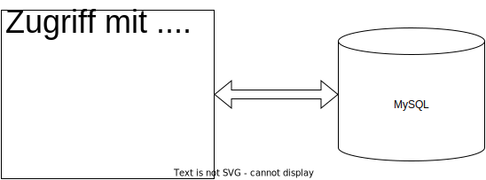
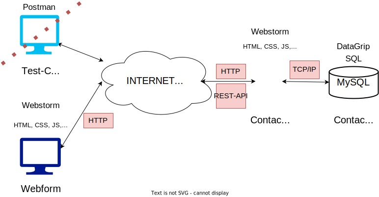
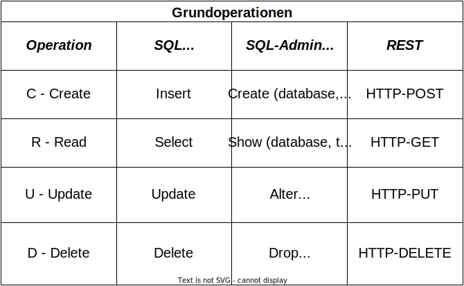
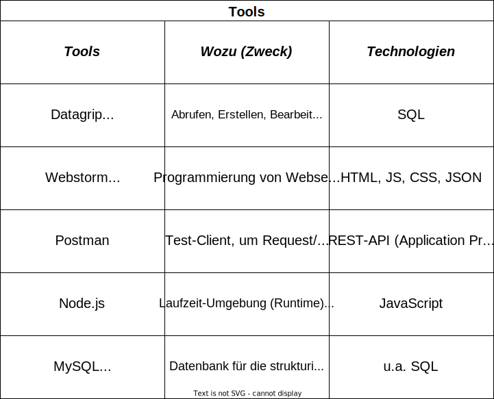
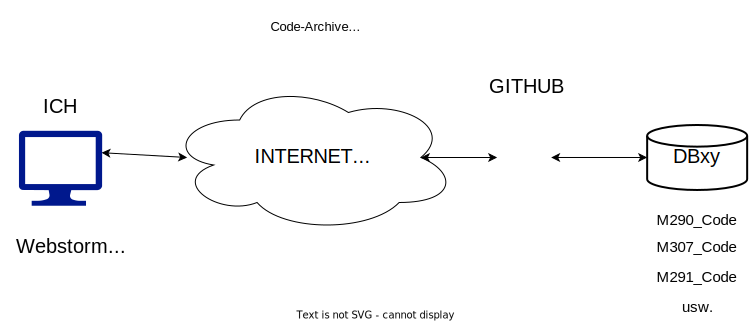

## Modul 290 - Datenbanken abfragen und verändern
Quellcode mit Übungen zum ICT-Modul 290

Mehr Informationen zum Modul siehe Webseite [ict.bzzlab.ch](http://ict.bzzlab.ch)

Author: daniel.garavaldi@bzz.ch

### Modul 290, Teil 12 (Repetition)

#### Datenbank
Leitfrage: Womit kann ich auf eine Datenbank zugreifen, damit 
ich die Datenbank verwalten, abfragen und mutieren kann?

#### Client, Server, Datenbank
Leitfrage: Wie sind Client, Webserver und Datenbank miteinander verbunden?

#### CRUD-Operatonen
Leitfrage: Welche CRUD-Operationen werden mit SQL für die Datenverwaltung,
SQL für die Datenbankstruktur und für die REST-API abgedeckt?

#### Tools
Leitfrage: Welche Tools (Software) werden wozu verwendet und welche grundlegende
Technologien werden dafür verwendet?

#### Was ist ein Repository?

